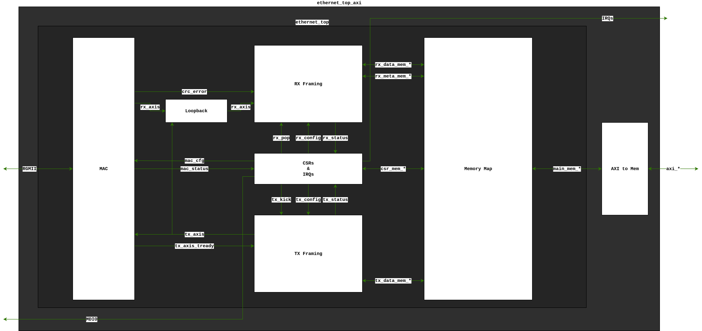

This Ethernet project provides a memory-mapped Ethernet device for FPGA.
The device handles MAC and exposes an RGMII interface to connect to a PHY off-chip.

Two memories are included: a write-only TX buffer and a read-only RX buffer.
In addition to a set of registers for control, status, and configuration.

The top level uses a simple memory interface with address spaces for each buffer and for the registers.


> **Block diagram of ```ethernet_top``` and ```ethernet_top_axi```**
> 
> Bidirectional arrows indicate addressable buses with a host and device end.
>
> The ```mem_*``` interfaces adhere to the simple memory interface described in ```mem_if_utils```. Each has a ```req``` (request) and ```rsp``` (response) struct.

# Structure
The design is broadly composed of seven top-level blocks as shown above. These are:

|Block|Top File|Description|
|---|---|---|
| AXI to Mem | `axi_to_detailed_mem.sv` | Accept an AXI4+ATOPs interface and translate to a simple memory interface. Provided by Pulp platform. |
| Memory map | `ethernet_mem_map.sv` | Accept one memory interface and map to four downstream memory interface according to the address MSBs. |
| TX Framing | `ethernet_tx_framing.sv` | Exposes a write-only memory interface for writing to the data buffer. Config/status signals are mapped to registers in the CSRs block. Also includes an FSM to begin sending packet data over AXI-Stream -- the FSM's is started by a pulse on the `tx_kick` line. |
| RX Framing | `ethernet_rx_framing.sv` | Wrapper around `axis_pkt_ring_buffer` which receives an AXI Stream and splits it into packets. Stream data is stored in a ring buffer and packet metadata (including pointers to the ring buffer) is stored in a FIFO. A pulse on `rx_pop` will remove one entry from this FIFO. Two read-only memory interfaces provide access to the ring buffer and the metadata table. |
| Loopback | `ethernet_loopback.sv` | Wrapper around `axis_pkt_mux`. This is slightly more complicated than a simple MUX because it has to guarantee that a packet is never spliced when a switch happens. Therefore, any in-progress packet on the current stream must complete before disabling that stream, then any in-progress packet on the new stream complete before enabling that stream. |
| MAC | `mac_wrapper.sv` | Wraps the Alex Forencich MAC `rgmii_soc.sv`, with modifications. Translates the two AXI Streams (TX/RX) to an RGMII interface. This block is quite technology-dependent because of precise interface timing and DDR. |

# Basic Operation

The design is broadly split into TX (transmit) and RX (receive) portions. Each has a buffer for storing packets.

The table below shows sections of an Ethernet frame and which should appear in the RX/TX buffers.

| Section                   | Length (bytes) | Visible to Host    |
|---------------------------|----------------|--------------------|
| Preamble                  | 7              | No                 |
| Start Frame Delimeter     | 1              | No                 |
| Destination MAC Address   | 6              | Yes                |
| Source MAC Address        | 6              | Yes                |
| 802.1Q Tag                | 0 or 4         | Yes                |
| EtherType or length       | 2              | Yes                |
| Payload                   | 42-1500        | Yes                |
| Frame Check Sequence      | 4              | No                 |
| Inter-Packet Gap          | 12             | No                 |

Items which say 'no' will be automatically appended to the TX and removed from the RX by the hardware. Items which say 'yes' should be written to the TX buffer when transmitting, and will appear in the RX buffer for received packets.

Simultaneous transmission and receiving is supported by the Ethernet IP, provided the PHY supports it as well.

## Transmission (TX)
TX is operated as follows:
- Data is written in 64-bit (8-byte) words to the TX buffer
- A register write to ```TX_CTRL``` triggers the TX to begin (from byte 0 in the buffer) - the write data includes the length of the transmission in bytes. The TX begins as a write side effect.
- A ```tx_busy``` flag will be set in the status register while transmitting.
- A ```tx_done``` flag will be set in the ```INTR_STATE``` register when done (write a 1 to clear this).

> **NOTE:** Data is written to the TX buffer in 64-bit words, but the packet length should always be indicated in bytes. Any extra bytes in the final written word will be ignored.

## Receiving (RX)
The Ethernet interface is always monitoring for incoming packets.

Packets will be dropped unless any of the following criteria are met:
- The first 6 bytes (destination MAC address) are the broadcast MAC address
- The first 6 bytes (destination MAC address) are a multicast MAC address (i.e. the first three bytes are 0x01005E)
- The first 6 bytes (destination MAC address) match the value in the ```mac_addr``` CSR
- The receiver is in 'promiscuous' mode

Incoming payload data is stored in a ring buffer with a size of 8192 bytes (enough for 5.4 max-size Ethernet packets).

A second memory region stores metadata about each packet - it has capacity for 8 packets. The metadata captured includes:
- A pointer to the payload data in the ring buffer
- The length (in bytes) of the received data
- The reason for capturing the packet (one of the four above)

> **NOTE:** Packets must be **explicitly** popped once the controller has seen them. This is accomplished by writing 1 to the ```pop``` register. This allows the hardware to reuse the memory location. You can only pop the oldest packet.

> **NOTE:** The oldest packet in the buffer is always stored at memory location 0 in the metadata table. Usually, the software should always read the metadata for packet 0, then pop that packet, and read the new packet 0, however you can also 'peek' at newer packets by reading later indices.

## Loopback
The Ethernet IP supports a loopback mode for testability. The loopback path includes the TX/RX framing mechanisms but not the MAC and PHY.

The loopback multiplexes the RX path. Therefore, while in loopback mode, RX packets arriving from the PHY will be ignored.

The TX path is still NOT masked during loopback i.e. packets you write in loopback mode are still exposed to the PHY.

## Interrupts
The interrupt state register has four status-type interrupts and three event-type interrupts.

### Status-type interrupts
These can only be cleared by servicing them (or masking them).

- ```rx_not_empty``` - one or more packets are available in the RX buffer.
- ```rx_table_almost_full``` - 6 or more packets are present in the RX metadata table.
- ```rx_table_full``` - the RX metadata table is full (8 packets).
- ```rx_buf_almost_full``` - the RX data buffer is almost full (remaining space is less than required to fit a max-size packet).

### Event-type interrupts
These are set by hardware events and cleared by writing a 1 to the corresponding bit positions in the interrupt state register.

- ```packet_lost``` - set when a packet is dropped due to full buffer
- ```tx_done``` - set when a transmission completes
- ```manual_irq``` - set by writing 1 to the interrupt test register

### Interrupt Mask
The interrupt mask register allows the controller to configure which interrupts it wishes to respond to.

A common configuration would be to:
- enable interrupts for the metadata table or RX buffer being almost full
- enable the manual interrupt for testing
- disable other interrupts

Then write an interrupt service routine to handle and pop all packets in the buffer whenever it is almost full.

The interrupt state register will always reflect the statuses outlined above regardless of the interrupt mask. However, the interrupt request line will only be asserted subject to the mask register.

<!-- TODO move this documentation to the RDL file and have it be auto-generated - best to keep docs close to the source code or they will go out of date! -->

## Registers
The up-to-date description of the register map is given in ```ethernet.rdl```. This serves as a specification, documentation, and the input for generators.

Additionally, note the following behaviours:

### RX Reconfiguring
Reconfiguring the RX path includes:
* Writing the MAC address register.
* Modifying the ```promiscuous``` or ```loopback``` fields.

Popping a packet in the buffer is NOT a reconfiguration and can be done safely at any time.

If RX is reconfigured during a TX, the TX will not be affected.

**Reconfiguration Hazards:**
* If the MAC address or 'promiscuous' config is changed while a packet is mid-receipt, the behaviour for that packet is not defined (it will depend on specifc internal timing) i.e. it may arrive or not arrive in the RX buffer.
* When the 'loopback' configuration changes, it may not take effect immediately. Any packets on the previously selected mode will be allowed to complete first, then any packets which are ongoing on the newly select path will complete before the RX begins listening on the new path. In the worst case, this could result in a delay of just under two packets (~3000 clock cycles) before the change takes effect.

A spliced or incomplete packet should never appear in the RX buffer.

### TX Reconfiguring
Reconfiguring the TX path includes:
* Writing the ```TX_CTRL``` register (where you specify the length of the TX packet)

The MAC address registers do not affect TX. Source MAC addresses must be included in the payload.

A write to ```TX_CTRL``` while another TX is in progress is forbidden. The host should check that the TX is free before writing to it, or guarantee this through other means. Violating this rule may result in a bad packet being transmitted.

Similarly, a write to the TX buffer while a TX is in progress is forbidden.
<!-- note: see ROADMAP for ideas about how to fix this, as it is a performance bottleneck -->

<!-- note: also see ROADMAP.md for idea about improving this -->

## Hardware Abstraction Layer
A hardware abstraction layer is provided for this design under `src/sw/ethernet.c`.

Documentation for it is included in the [programmer's guide](doc/programmers_guide.md).

# Development

## Requirements
- Ensure Vivado is on your PATH (including 'xsim' and 'xelab').
- Ensure Verilator is on your PATH

This project has dependencies from lowRISC's ```OpenTitan``` for primitives. FuseSoC will automatically retrieve these based on the library configured in ```fusesoc.conf```, but you can override this behaviour if you prefer to manage your own FuseSoC libraries.

## Targets
The table below outlines two top-level cores and various targets available for them.

| SV Module           | `ethernet_top`           | `ethernet_top_axi`           |
|---------------------|--------------------------|------------------------------|
| FuseSoC Core        | `lowrisc:ethernet:top`   | `lowrisc:ethernet:axi_top`   |
| Description         | Basic Ethernet top with a simple memory interface | Wrapper around `ethernet_top` with an AXI interface |
| **FuseSoC Targets** | | |
| `target=sim`        | Vivado simulation        | Verilator/CocoTB simulation  |
| `target=trial_synth`| -                        | Vivado synthesis             |
| `target=lint`       | Verilator lint           | Verilator lint               |

To invoke a flow, run:
```sh
uv run fusesoc run --target=<target> <core>
```

For example:
```sh
uv run fusesoc run --target=sim lowrisc:ethernet:axi_top
```

Make sure you run FuseSoC from the same directory that contains ```fusesoc.conf```. FuseSoC will look at ```fusesoc.conf``` to find the Ethernet core and its dependencies.

## Testbenches
There are two testbenches available for this project:
* ```ethernet_top``` can be tested with a SystemVerilog testbench. Currently this test suite is not comprehensive but is fast and useful for smoke tests.
* ```ethernet_top_axi``` has a testbench driven using CocoTB and an AXI driver library. This is intended to be the main test suite and targets 100% coverage.

It is recommended you run both test suites because there can be differences in behaviour between different simulators.

### CocoTB Tests
The DUT is typically accessed through three layers:

- an AXI driver instance is bound to the DUT's AXI interface to it, allowing easy access to read/write operations to a specified address
- an ```EthernetTopWrapper``` instance wraps this, providing conveniently-named methods for accessing each register or buffer
- an ```EthernetTopDutWithMirror``` instance wraps that, providing the same methods but also instantiating a Python model of the DUT. After each ```get``` call, the model and the DUT's output are asserted to be equal.

A typical test flow is:
* Instantiate ```EthernetTopDutWithMirror```
* Set the mode and MAC address
* Perform the behaviour being tested
* Get the DUT status and read the data buffers. The ```get``` calls will prompt the testbench to compare the DUT with the model.

## Test configurations
`test_utils.py` allows test `TestConfiguration` parameters to be modified. These are:

* `randomise_test_order` (boolean). Recommended to enable.
* `between_tests` (`"REINITIALISE"` or `"RESET"`). `"RESET"` will assert the DUT between tests whereas `"REINITIALISE"` will use register writes to return to a known state. The former is faster but the latter may catch more bugs. When using `REINITIALISE`, it is possible (though uncommon) for state to carry over between tests, meaning one failure may cascade across several tests.
* `health_test_all` (boolean). Run a 'health test' on the DUT after each test case -- the health test ensures the DUT is not stuck in a bad state and can still perform a basic loopback and register accesses.
* `tag_matcher` (callable). Callable of form `tag_matcher(tags_list)`, returns a boolean indicating whether a test should run or not according to its tags. Can be modified to select a subset of tests.

Each test is tagged with **one** of the following tags:

|Tag|Approx. Simulation Time*|Purpose|
|---|---|---|
|`Tags.MICRO` | 20-30 us        | A 'micro' test suite, primarily useful for checking the DUT elaborates, and connection is established between the testbench and the DUT. Very little coverage of the DUT's features. |
|`Tags.SMOKE` | 350-400 us      | Covers hot paths of the DUT and touches each feature at least once. Does not cover edge cases or credible stress testing. |
|`Tags.MAIN`  | 500-600 us      | The majority of test cases including some more unusual behaviours, back-to-back TX/RX, and error conditions. |
|`Tags.EDGE`  | 900-1000 us     | Adds a large number of tests targetting particular edge cases for different features. |
|`Tags.LONG`  | 2500-3000 us    | Adds a small number of long-running randomised tests. |

\* The ratio of simulation time to real time will depend on your machine. On a AMD Ryzen AI 7 350 it is approximately 50 us/s.

The random seed for each test run is printed near the top of the log file. To set the seed for a run, set the environment variable:
```bash
export RANDOM_SEED=123
```
Remember to unset this later.

## Coverage
The AXI top supports coverage tracking (the Vivado simulation does not). The table below shows three kinds of coverage.

| Coverage type         | FuseSoC argument | Note |
|-----------------------|------------------|------|
| FSM coverage          | `--flag fcov`      | FSMs are infered by Verilator since Verilator 5.048 (Apr. 2026). Not yet a mature feature. |
| Toggle coverage       | `--flag tcov`      | Track toggling of all nets in the design. |
| User-defined coverage | `--flag pcov`      | Includes 'covergroup' instances (since Verilator 5.050 (July 2026)) and 'cover property' statements. |

Flags should be placed after the 'run' argument, and can be stacked. For example:
```sh
uv run fusesoc run --flag pcov --flag tcov --target=sim lowrisc:ethernet:axi_top
```

To analyse coverage, you should first run the simulator with coverage (as above) then run `report_coverage.sh`. This will create:
* `reports/coverage_gaps.txt` - a list of nets/coverpoints which have coverage gaps
* `reports/coverage_report.txt` - a hierarchical report of coverage by module/covergroup
* Copies of source files in the `build/` directory which are annotated with coverage metrics

<!-- TODO having a separate shell script for this is not ideal - it would be preferably to unify the command to invoke simulations, run lint, generate coverage reports, etc. into a single build system, but FuseSoC does not easily accommodate this. A long-term objective is to use FuseSoC only for its setup phase (finding source files and generating filelists) and rely on a better build system for running simulations and reporting -->

## Debugging Waveforms
Both simulators used in this project allow waveforms to be inspected for debugging. Verilator is the preferred simulator, but Vivado is also available.

When using Verilator to run the `ethernet_top_axi`, waveforms are dumped into a `sim.fst` file. This can be opened in Surfer (or similar) for debugging.

When reading these waveforms, you will see the entire test suite executing. To differentiate one test from the next, it is useful to add the three counters `tests_done`, `tests_passed`, `tests_failed` to your wave window. These are in the testbench toplevel.

When using Vivado to run the `ethernet_top`, you can open a GUI for waveforms by `cd`-ing into `build/<corename>/sim-xsim` and running `make run-gui`.

## Macro \`DEFINEs
The following is a non-exhaustive list of macros defined or used in this codebase.

| Name | Note |
|-|-|
| `VERILATOR` | Defined by Verilator when a Verilator sim is run. Not used in this code but may be used by dependencies for disabling unsupported features by Verilator. |
| `COVERAGE` | Defined by FuseSoC when the user-defined coverage flag is passed in. Creates coverage properties and cover groups which will otherwise be removed by the preprocessor. |
| `ASSERT` | Defined by a dependency `prim_assert.sv`. Creates an assertion which samples on `clk_i` (by default) and disables on `rst_ni` (by default). |

<!-- TODO havivng a little table in the README feels like a very fragile way of documenting this and in my experience these DEFINEs are a major source of bugs and flow issues. Maybe automate the documentation, or find a way to eliminate dependency on them entirely.-->

## Directory structure

```
src
├── sw
└── hw
    ├── axi_eth
    │   ├── cov
    │   ├── synth
    │   └── verif
    ├── core_eth
    │   ├── csr
    │   ├── loopback
    │   ├── mac
    │   ├── rx_framing
    │   ├── tx_framing
    │   ├── top
    │   └── verif
    └── util
        ├── axis_pkt_ring_buffer
        ├── mem_if_utils
        └── random_access_fifo
```

The contents of ```hw/util``` are decoupled from the Ethernet with the intention that they can be reused in future projects.

## Non-RTL files
The table below explains the contents of a selection of non-RTL files.

| Path | Description |
|--|--|
| [ethernet.rdl](src/ethernet.rdl)          | A SystemRDL (register description language) which the memory map and register map for this design. |
| [ethernet.drawio](doc/ethernet.drawio)    | A collection of drawio diagrams providing both intra-module block diagrams and module-level templates for pasting into larger diagrams. |
| [ethernet.c](src/sw/ethernet.c)           | Provides hardware-abstraction layer methods for reading/writing the TX/RX buffers and control/status registers. |

# Credits
The MAC for this project was adapted from an older version of the Alex Forencich RGMII Ethernet MAC. It was forked in January 2019 and subsequently modified for lowRISC. That version of the MAC is under an MIT license.
