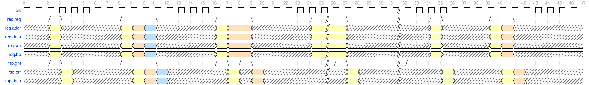

This core provides several useful utilities for a simple memory interface. The interface has the following signals, split into a `req` (request) and `rsp` (response) struct:

| Name              | Width         | Driven by | Validity                                    | Note |
|-------------------|---------------|-----------|---------------------------------------------|------|
| `req.req`         | 1             | Master    | Always valid.                               | Request access to memory (either read or write). |
| `rsp.gnt`         | 1             | Slave     | Always valid.                               | Grant access.                                    |
| `req.addr`        | `ADDR_W`      | Master    | Valid when `req.req`                        | Address to access.                               |
| `req.data`        | `DATA_W`      | Master    | Valid when `req.req && req.we`              | Write data.                                      |
| `req.we`          | 1             | Master    | Valid when `req.req`                        | Write enable.                                    |
| `req.be`          | `DATA_W/8`    | Master    | Valid when `req.req && req.we`              | Write byte enable.                               |
| `rsp.err`         | 1             | Slave     | Valid AFTER `req.req && rsp.gnt`            | Error response (to read or write).               |
| `rsp.data`        | `DATA_W`      | Slave     | Valid AFTER `req.req && rsp.gnt && !req.we` | Read data response (to a read).                  |

Some behaviours of note:
* The `rsp.err` and `rsp.data` signals are valid on the cycle AFTER the handshake. This allows slaves who do not require wait states to tie `req.gnt = 1` and give single-cycle latency.
* `rsp.err` and `rsp.data` are only valid for a single cycle so the master must be able to sample them immediately.
* A slave may assert `req.gnt` proactively or reactively. A master must drive `req.req` proactively to avoid deadlocks. Slaves may (and often will) tie `req.gnt = 1`.
* Once `req.req` is asserted, it must remain asserted until `req.req && req.gnt`.
* Request fields (`req.addr, req.data, req.we, req.be`) must remain stable while `req.req` is asserted, and may change following a handshake.
* If an error response is given, `rsp.data` may be undefined. However, memory infrastructure should still route the signal as if it it were valid, and slaves MAY use this to give a response to the master e.g. indicating the nature of the error.

# Example waveforms

<!--
See waveforms at
https://wavedrom.com/editor.html?%7Bsignal%3A%20%5B%0A%20%20%7B%20name%3A%20%27clk%27%20%20%20%20%20%20%20%20%20%20%20%20%20%20%20%20%20%20%20%20%20%2C%20wave%3A%20%27p..............................%7C...............%27%20%7D%2C%0A%20%20%7B%20name%3A%20%27req.req%27%20%20%20%20%20%20%20%20%20%20%20%20%20%20%20%20%20%2C%20wave%3A%20%270.10....1..0....1..0....1%7C.0...%7C..10...1.0.....%27%20%7D%2C%0A%20%20%7B%20name%3A%20%27req.addr%27%20%20%20%20%20%20%20%20%20%20%20%20%20%20%20%20%2C%20wave%3A%20%27x.3x....345x....34.x....3%7C.x...%7C..3x...34x.....%27%20%7D%2C%0A%20%20%7B%20name%3A%20%27req.data%27%20%20%20%20%20%20%20%20%20%20%20%20%20%20%20%20%2C%20wave%3A%20%27x.3x....345x....34.x....3%7C.x...%7C..3x...34x.....%27%20%7D%2C%0A%20%20%7B%20name%3A%20%27req.we%27%20%20%20%20%20%20%20%20%20%20%20%20%20%20%20%20%20%20%2C%20wave%3A%20%27x.3x....345x....34.x....3%7C.x...%7C..3x...34x.....%27%20%7D%2C%0A%20%20%7B%20name%3A%20%27req.be%27%20%20%20%20%20%20%20%20%20%20%20%20%20%20%20%20%20%20%2C%20wave%3A%20%27x.3x....345x....34.x....3%7C.x...%7C..3x...34x.....%27%20%7D%2C%0A%20%20%7B%20name%3A%20%27rsp.gnt%27%20%20%20%20%20%20%20%20%20%20%20%20%20%20%20%20%20%2C%20wave%3A%20%270.10....1..0....1010.....%7C10...%7C1..............%27%20%7D%2C%0A%20%20%7B%20name%3A%20%27rsp.err%27%20%20%20%20%20%20%20%20%20%20%20%20%20%20%20%20%20%2C%20wave%3A%20%27x..3x....345x....3x4x....%7C.3x..%7C...3x...34x....%27%20%7D%2C%0A%20%20%7B%20name%3A%20%27rsp.data%27%20%20%20%20%20%20%20%20%20%20%20%20%20%20%20%20%2C%20wave%3A%20%27x..3x....345x....3x4x....%7C.3x..%7C...3x...34x....%27%20%7D%2C%0A%5D%2C%0A%20head%3A%7B%20tick%3A%200%20%7D%2C%0A%7D%0A%0A
-->

Note that transactions are always shown with colour-coded responses, but the response data may not actually be valid if the transaction was a write. Similarly the write data and byte enable may not be valid for reads. This does not affect the timing.

* Cycles 0-6 show a simple transaction with no wait states.
* Cycles 8-12 demonstrate back-to-back transactions with pipelining and no wait states.
* Cycles 16-20 show back-to-back transactions with a wait state inserted by the slave.
* Cycles 24-28 show how the slave can delay a transaction for an arbitrary length of time.
* Cycles 34-36 show a slave asserting `rsp.gnt` proactively.
* Cycles 39-42 show a slave assertion `rsp.gnt` proactively for back-to-back transactions.
